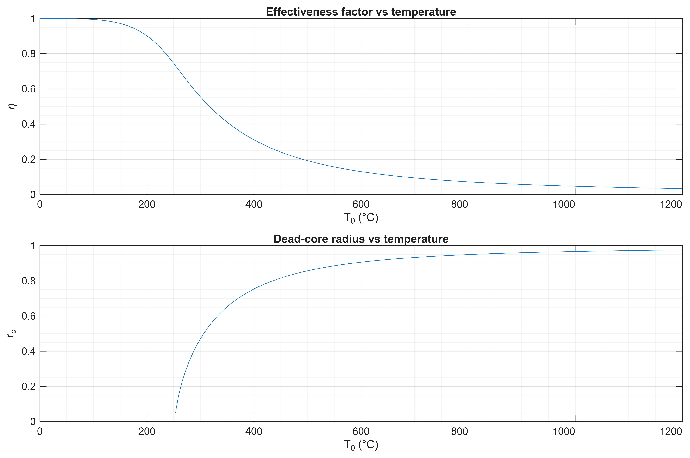
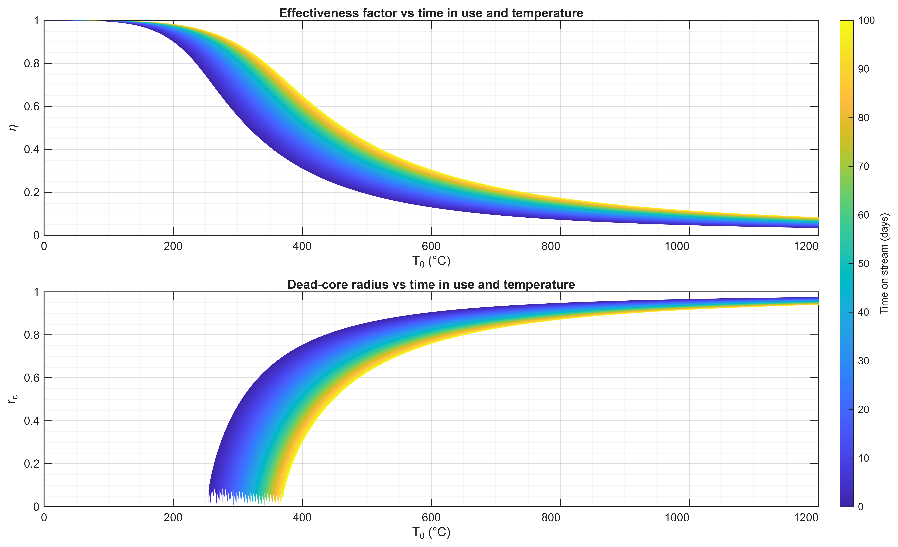
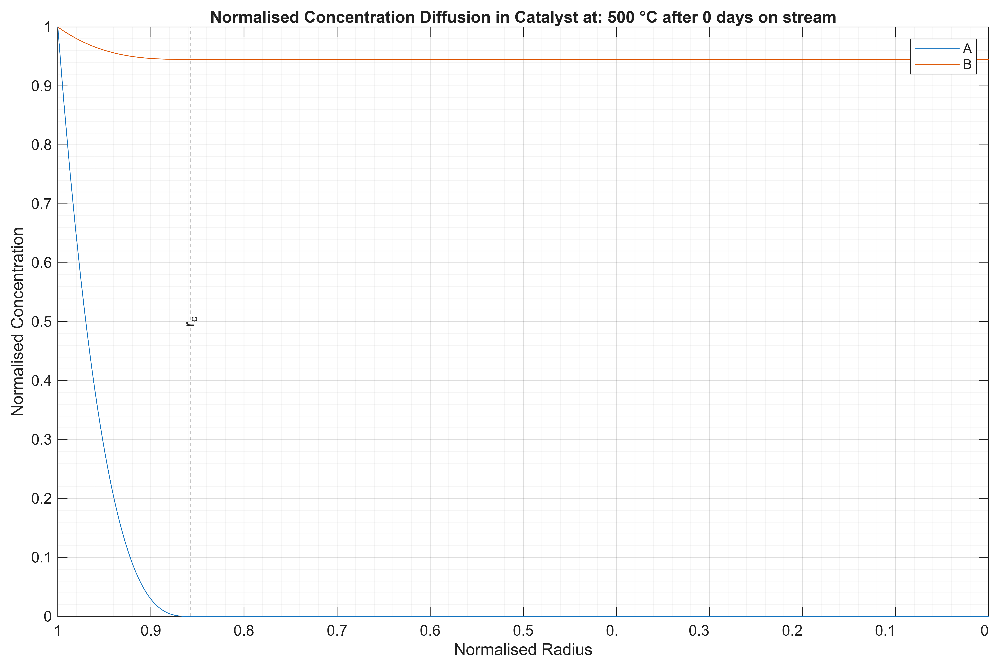
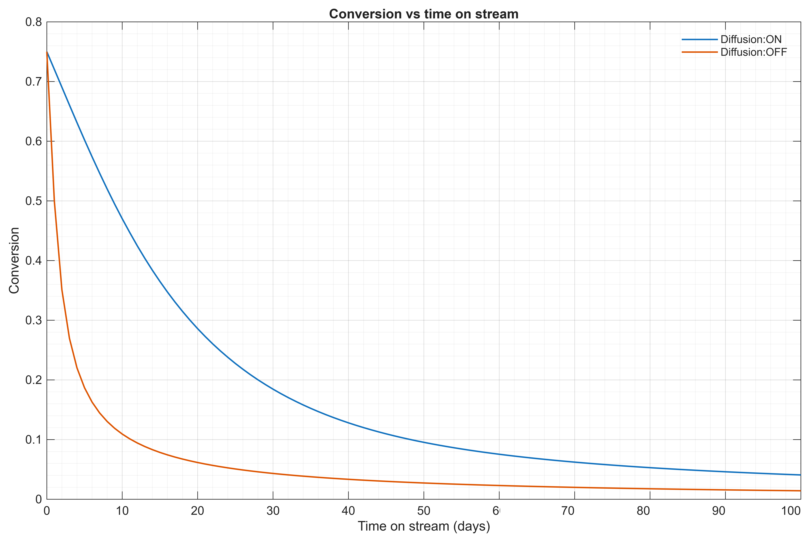
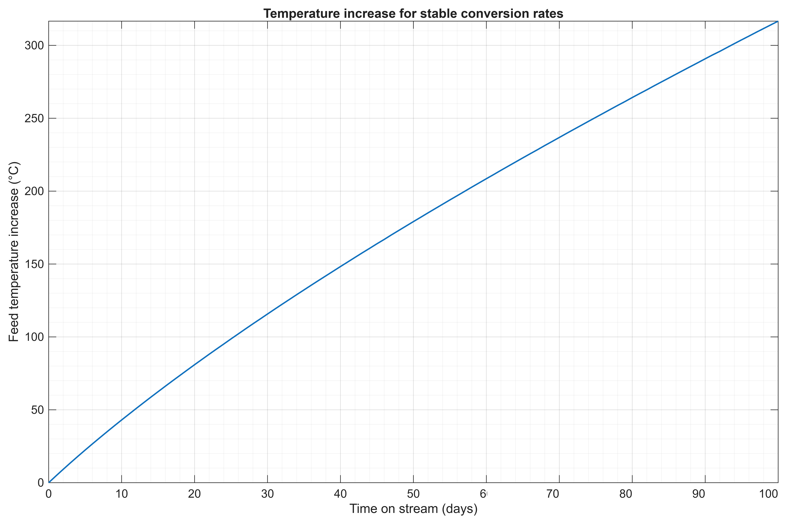

# Multi-species catalyst pellet diffusion-reaction modeling with temperature-dependent dead-core bifurcation and catalyst deactivation, feeding a PFR reactor model

## Overview
This project models diffusion and reaction inside a porous catalyst pellet for a two-reactant, partial-order catalytic reaction ($rate ∝ C_A^{1/3}C_B^{2/3}$), coupled with Arrhenius temperature dependence and time-dependent catalyst deactivation. It solves the governing boundary value problem numerically in MATLAB, builds multi-dimensional lookup tables of the pellet's effectiveness factor across operating conditions, and uses them to drive a plug-flow reactor model.

Due to the fractional reaction orders, the pellet can develop a dead core (an interior region where a reactant is fully depleted) above a critical temperature. This introduces bifurcation in the governing equation. Beyond onset, the standard diffusion-reaction boundary value problem becomes numerically singular. Two numerical approaches are implemented and cross-validated against each other, a regularized approximation for general use, and an exact free-boundary formulation that solves for the dead-core radius directly as an unknown parameter.

Reaction parameters are illustrative rather than drawn from a specific real process; the focus of this project is the numerical methodology handling singular boundary value problems, bifurcation detection, multi-dimensional parameter sweeps, and structuring a reusable reactor-scale model rather than a particular industrial design case.

## Key results

Figure 1 — η and r_c vs. temperature



*Effectiveness factor (η) and dead-core radius (r_c) as a function of pellet surface temperature. Below ~253°C the pellet is fully active throughout; above this threshold, a dead core forms and grows, sharply reducing the pellet's effective reaction rate.*

Figure 2 — η(T,t) surface



*Effectiveness factor as a function of both temperature and catalyst time-in-use. Counter-intuitively, effectiveness improves as the catalyst deactivates since fresh, highly active catalyst reacts fast enough to be strongly diffusion-limited at high temperature, while a partially deactivated catalyst reacts slowly enough that diffusion can keep pace, recovering overall effectiveness.*

Figure 3 — Normalised concentration profile with the dead core marked



*Radial concentration profiles for species A and B within the pellet at a representative high-temperature condition, showing the dead-core boundary (r_c) where species A is fully depleted.*

Figure 4 — Conversion vs time on stream with diffusion effects



*Predicted conversion decay with catalyst deactivation, for reactors sized to achieve identical initial conversion with and without pellet-scale diffusion limitation. The diffusion-limited case degrades substantially more gradually, diffusion resistance buffers the reactor's performance against early-life deactivation.*

Figure 5 — Temperature alteration for constant conversion rate



*Inlet temperature increase required to maintain target conversion as the catalyst deactivates, found via root-finding against the η(T,t) lookup table. Required temperature increase grows steadily as activity declines. Beyond a certain time-on-stream the target conversion becomes increasingly more costly due to the higher temperatures required, with the replacement interval being dependent on this.*

## Repository structure

```text
reactor-simulation/
├── README.md
├── LICENSE
├── src/
│   ├── Diffusion.m
│   ├── Reactor.m
│   ├── Initial_Conditions_and_Constants.m
│   ├── Graph_Diffusion.m
│   └── Graph_Reactor.m
├── docs/
│   └── methodology.md
├── figures/
│   ├── Effectiveness_factor_and_dead_core_radius_vs_temperature.png
│   ├── Effectiveness_factor_and_dead_core_radius_vs_temperature_and_time_on_stream.png
│   ├── Diffusion_T_500C_Day_0.png
│   ├── Effectiveness_factor_and_dead_core_radius_vs_temperature_and_conversion.png
│   ├── conversion_vs_TOS.png
│   ├── Temperature_increase_for_constant_conversion.png
│   ├── Conversion.png
│   ├── mole_fraction.png
│   └── temperature_and_pressure.png
```

### Requirements

- MATLAB (developed/tested on R2024a or later)
- Parallel Computing Toolbox *(optional — `parfor`/`parfeval` calls fall back to serial execution automatically if unavailable, at significantly increased runtime for table generation)*
- No other toolboxes required

## How to Run

1. **Set parameters.** Open `Initial_Conditions_and_Constants.m` and review the reactor, kinetic, and catalyst properties, this script builds the `C` struct used throughout the project.

2. **Generate the pellet-scale lookup tables.** Run `Graph_Diffusion.m`. This will:
   - Prompt to load, rerun, or skip each of three sweeps (temperature-only, temperature-vs-conversion, temperature-vs-time-in-use)
   - Save results to `data/` and figures to `figures/`
   - Full table generation (temperature-vs-time-in-use) takes approximately 20 minutes on a 8-core machine with Parallel Computing Toolbox; expect significantly longer without it

3. **Run the reactor-scale model.** Run `Graph_Reactor.m`. This loads the lookup tables generated in step 2 and:
   - Produces single-pass reactor profiles (conversion, temperature, pressure vs. reactor length)
   - Runs the catalyst deactivation sweep and temperature-compensation search
   - Exports the remaining figures to `figures/`

**Note:** Step 3 depends on tables generated in step 2 — running `Graph_Reactor.m` before `Graph_Diffusion.m` has completed at least once will fail at the table-load step.

## Limitations

**Convergence near the dead-core bifurcation onset.** The transition where a species' concentration first reaches zero within the pellet is a mathematical bifurcation where the dead-core radius grows with an infinite initial slope at onset, which makes the free-boundary formulation's Jacobian ill-conditioned in a narrow region immediately above the critical temperature. This is handled via a regularized soft-floor approximation, cross-validated against the exact free-boundary solution away from onset (agreement to within <0.01% in effectiveness factor). A small number of grid points immediately adjacent to the exact onset boundary carry increased numerical error as a result.

**Stoichiometric feed assumption in the composition sweep.** For a feed with A and B supplied in exactly their stoichiometric ratio, the effectiveness factor is independent of conversion (a direct consequence of the reaction orders, see `docs/methodology.md`). The (T,X) table and sweep code generalize to non-stoichiometric feeds, but this has not been validated against a feed with reactant excess. The current reactor setup is set to use the η(T,t) surface and would need altering to use η(T,X).

**Single-pellet, single-particle-size model.** The pellet model assumes a uniform spherical particle size and uniform surface conditions; particle size distribution, bed-scale channeling, and external (film) mass-transfer resistance are not modeled. The reactor model assumes ideal plug flow.

**Lookup table range.** The reactor model queries the pellet-scale tables by interpolation; operating conditions outside the generated table's (T, t) range will raise an explicit error rather than extrapolate. Table ranges used are documented in each table's saved metadata (`tableInfo`).

**Illustrative parameters.** Kinetic and physical constants used throughout are representative with them being used to demonstrate the numerical methodology rather than constitute a specific process design.
